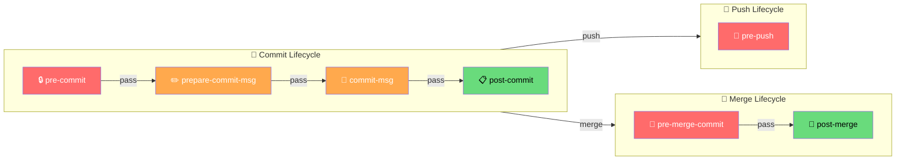
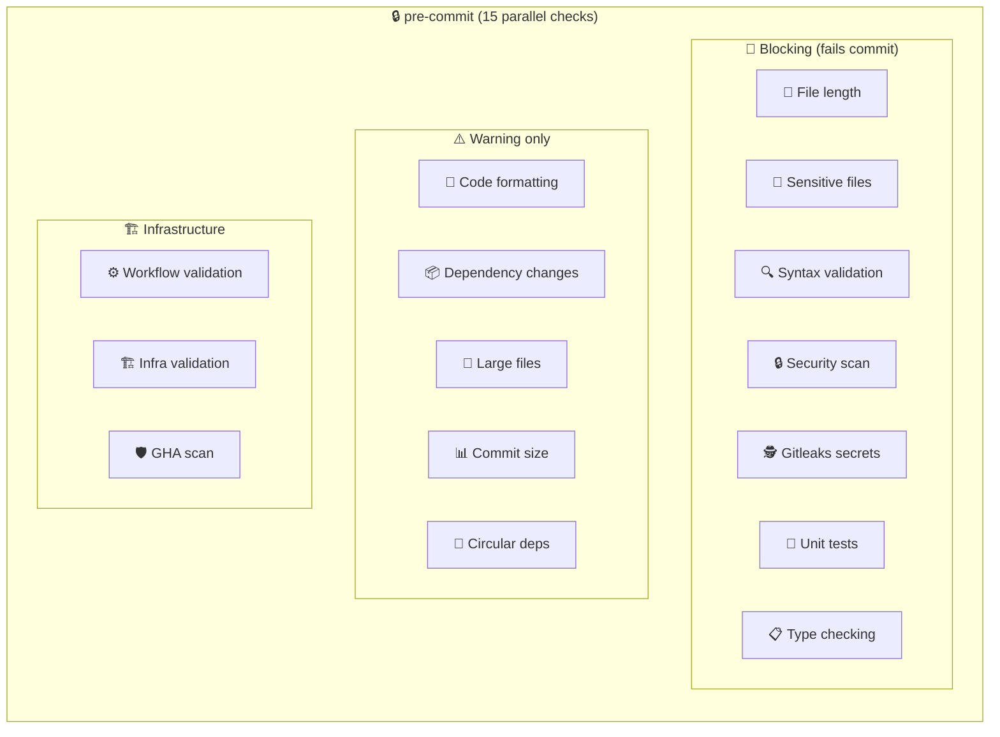

# Git Hooks Pipeline Reference

Complete reference for every git hook stage in shell-config, what runs at each stage,
what can block, and how the stages connect.

---

## Pipeline Diagram

### Pre-Commit Internal Pipeline

---

## Stage Details

### Overview Table

| # | Hook | Lifecycle | Can Block? | Bypass | Purpose |
|---|------|-----------|------------|--------|---------|
| 1 | `pre-commit` | Commit | **Yes** | `--no-verify` or `GIT_SKIP_HOOKS=1` | Run all validators, linters, and scanners on staged files |
| 2 | `prepare-commit-msg` | Commit | **Yes** | `--no-verify` | Auto-prepend conventional commit prefix from branch name |
| 3 | `commit-msg` | Commit | **Yes** | `--no-verify` | Validate commit message format (length, trailing whitespace) |
| 4 | `post-commit` | Commit | No (advisory) | N/A | Log dependency changes to audit file |
| 5 | `pre-push` | Push | **Yes** | `--no-verify` | Run tests on changed files (warning only currently) |
| 6 | `pre-merge-commit` | Merge | **Yes** | `--no-verify` | Detect merge conflict markers, run tests |
| 7 | `post-merge` | Merge | No (advisory) | N/A | Auto-install dependencies when lockfiles change |

*(See the unified [Journey View table](#column-per-stage-table) below for what runs at each stage.)*

---

## Stage-by-Stage Breakdown

### Stage 1: `pre-commit` — The Gatekeeper

**When:** Runs first, before the commit message editor even opens.
**Input:** All staged files (`git diff --cached --name-only --diff-filter=ACM`).
**Can block:** Yes. If any blocking check fails, the commit is aborted.

This is the heaviest hook — it runs **15 checks in parallel** using background processes.
Everything in the "pre-commit validators" and "linters/scanners" sections of the MOTD
runs here. This includes:

- **File length validation** — 3-tier system: info (>target), warning (>warning), block (>max)
- **Sensitive filename detection** — blocks commits containing `.env`, `.pem`, `credentials.*`
- **Syntax validation** — runs shellcheck, oxlint, ruff, yamllint, sqruff, hadolint on matching files
- **Code formatting** — runs prettier (warning only, configurable to block)
- **Dependency change warnings** — warns when `package.json`, `Cargo.toml`, etc. change
- **Large file detection** — warns on files >5MB
- **Commit size analysis** — 3-tier: info (>1000 lines/15 files), warning (>3000/25), extreme (>5000/76)
- **OpenGrep security scanning** — deep security scan for vulnerability patterns
- **Gitleaks secrets scanning** — detects API keys, tokens, passwords in staged files
- **Unit tests** — runs `bun test` if available
- **TypeScript type checking** — `tsc --noEmit`
- **Python type checking** — `mypy` via `uv`
- **Circular dependency detection** — `dpdm` for JS/TS projects
- **Workflow validation** — actionlint, zizmor, octoscan, pinact, poutine on `.github/` files
- **Infrastructure validation** — validates Dockerfiles, Terraform, K8s manifests

### Stage 2: `prepare-commit-msg` — The Auto-Formatter

**When:** Runs after the default commit message template is created, before the editor opens.
**Input:** The commit message file, the source of the message (message/template/merge/squash/commit).
**Can block:** Yes (technically), but in practice it only modifies the message.

This hook auto-generates a conventional commit prefix based on the branch name:
- Branch `feat/add-login` → prepends `feat: ` to the commit message
- Branch `fix/123-broken-auth` → prepends `fix(#123): `
- Only runs if `GIT_AUTO_BRANCH_PREFIX=1` is set (disabled by default)
- Skips merge commits (git auto-generates the message)
- Skips if the message already has a conventional commit prefix

### Stage 3: `commit-msg` — The Message Validator

**When:** Runs after the user writes their commit message and saves/closes the editor.
**Input:** The commit message file.
**Can block:** Yes. Rejects commits with bad messages.

Validates the commit message format:
- **Empty message** → blocks (exit 1)
- **Subject too long** (>72 chars) → blocks
- **Subject too short** (<3 chars) → blocks
- **Trailing whitespace** on subject → blocks
- **Subject ends with period** → warns (not blocking)
- **Conventional commits format** → blocks if `GIT_ENFORCE_CONVENTIONAL_COMMITS=1`
- **Missing blank line** between subject and body → warns
- **Body lines >72 chars** → warns

### Stage 4: `post-commit` — The Auditor

**When:** Runs after the commit object is created. Cannot abort the commit.
**Input:** The committed files (via `git diff --name-only HEAD~1 HEAD`).
**Can block:** No. This is advisory only.

Logs dependency file changes to `~/.phantom-guard-audit.log` for security auditing.
If `package.json`, `requirements.txt`, `Cargo.toml`, `go.mod`, `Gemfile`, or
`composer.json` changed in the commit, it records the commit hash, author, date,
branch, and which files changed. This creates an audit trail for supply chain security.

### Stage 5: `pre-push` — The Safety Net

**When:** Runs before `git push` sends commits to the remote.
**Input:** Changed files in the push range (`$remote_branch..HEAD`).
**Can block:** Yes (but currently only warns).

Runs tests on the changed files as a final check:
- Runs `bun test` if `package.json` has a `test` script
- Currently **warning only** — does not block the push
- Secrets scanning was removed from here (already done in pre-commit)
- Workflow validation was removed from here (already done in pre-commit)

### Stage 6: `pre-merge-commit` — The Merge Guard

**When:** Runs before completing a merge commit (like `git merge feature-branch`).
**Input:** All staged files (the merged result).
**Can block:** Yes.

Two checks:
1. **Merge conflict markers** — scans all staged files for `<<<<<<<`, `=======`, `>>>>>>>`.
   If found, the merge is aborted. This prevents accidentally committing unresolved conflicts.
2. **Tests** — runs `bun test` as a warning (does not block).

### Stage 7: `post-merge` — The Dependency Manager

**When:** Runs after a successful merge (including `git pull`).
**Input:** Files changed between previous HEAD and current HEAD.
**Can block:** No. This is advisory only.

Automatically installs dependencies when lockfiles change:
- `package.json` → runs `bun install` / `npm install` / `pnpm install` / `yarn install`
- `requirements.txt` → runs `pip install -r requirements.txt`
- `Pipfile` → runs `pipenv install`
- `pyproject.toml` → runs `poetry install`
- `Cargo.toml` → runs `cargo fetch`
- `go.mod` → runs `go mod download`
- `Gemfile` → runs `bundle install`
- `composer.json` → runs `composer install`

This prevents the classic "I pulled and now nothing works" problem.

---

## Validators & Linters Reference

These are the **tools** that run inside `pre-commit`. They are separate from the hooks themselves.

### Validators (shell-config scripts)

| Validator | File | What it checks |
|-----------|------|---------------|
| File length | `validators/core/file-validator.sh` | Line count against 3-tier thresholds |
| Sensitive files | `validators/security/sensitive-files-validator.sh` | Filenames matching dangerous patterns |
| Syntax | `validators/core/syntax-validator.sh` | Dispatches to language-specific linters |
| Security | `validators/security/security-validator.sh` | OpenGrep security patterns |
| Workflow | `validators/infra/workflow-validator.sh` | GitHub Actions workflow files |
| Infrastructure | `validators/infra/infra-validator.sh` | Dockerfiles, Terraform, K8s manifests |
| Validation loop | `git/shared/validation-loop.sh` | Orchestrates running validators on staged files |

### External Linters (installed tools)

| Tool | Languages | Install |
|------|-----------|---------|
| shellcheck | Bash/Shell | `brew install shellcheck` |
| oxlint | JavaScript/TypeScript | `brew install oxlint` |
| ruff | Python | `brew install ruff` |
| yamllint | YAML | `brew install yamllint` |
| sqruff | SQL | `brew install sqruff` |
| hadolint | Dockerfiles | `brew install hadolint` |

### Security Scanners (installed tools)

| Tool | What it scans | Install |
|------|--------------|---------|
| gitleaks | Secrets (API keys, tokens, passwords) | `brew install gitleaks` |
| actionlint | GitHub Actions workflow syntax | `brew install actionlint` |
| zizmor | GitHub Actions security | `brew install zizmor` |
| octoscan | GitHub Actions permissions | `brew install octoscan` |
| pinact | GitHub Actions pinned versions | `brew install pinact` |
| poutine | GitHub Actions supply chain | `brew install poutine` |
| opengrep | Security patterns (SAST) | `brew install opengrep` |

---

## Journey View: What Happens at Each Stage

Read left-to-right to follow a change through the full git lifecycle.
Each column lists everything that runs at that stage — no blocking/warning distinction,
just what happens.

### Mermaid Journey

```mermaid
flowchart LR
    subgraph S1["🔒 pre-commit"]
        direction TB
        S1a["📐 File length check"]
        S1b["🔐 Sensitive files check"]
        S1c["🔍 Syntax: shellcheck · oxlint · ruff\n     yamllint · sqruff · hadolint"]
        S1d["🎨 Code formatting (prettier)"]
        S1e["📦 Dependency change detection"]
        S1f["📊 Large file + commit size"]
        S1g["🔒 Security scan (OpenGrep)"]
        S1h["🕵️ Secrets scan (Gitleaks)"]
        S1i["🧪 Unit tests (bun test)"]
        S1j["📋 Type check (tsc · mypy)"]
        S1k["🔗 Circular deps (dpdm)"]
        S1l["⚙️ Workflow: actionlint · zizmor\n     octoscan · pinact · poutine"]
        S1m["🏗️ Infra validation"]
    end

    subgraph S2["✏️ prepare-\ncommit-msg"]
        direction TB
        S2a["🏷️ Branch → prefix\nfeat/login → 'feat: '\nfix/123 → 'fix(#123): '"]
    end

    subgraph S3["💬 commit-msg"]
        direction TB
        S3a["📏 Subject ≤ 72 chars"]
        S3b["📝 Non-empty message"]
        S3c["✂️ No trailing whitespace"]
        S3d["📐 Conventional format"]
        S3e["📄 Body line length"]
    end

    subgraph S4["📋 post-commit"]
        direction TB
        S4a["📋 Log dep changes\nto audit file"]
    end

    S1 --> S2 --> S3 --> S4

    subgraph S5["🚀 pre-push"]
        direction TB
        S5a["🧪 Unit tests\n(bun test)"]
    end

    S4 -.->|"git push"| S5

    subgraph S6["🔀 pre-merge-\ncommit"]
        direction TB
        S6a["🔀 Conflict marker scan"]
        S6b["🧪 Unit tests\n(bun test)"]
    end

    subgraph S7["🔄 post-merge"]
        direction TB
        S7a["📦 Auto-install deps\nbun · npm · pip\ncargo · go · bundle"]
    end

    S4 -.->|"git merge"| S6 --> S7

    style S1 fill:#1a1a2e,color:#e0e0e0,stroke:#ff6b6b
    style S2 fill:#1a1a2e,color:#e0e0e0,stroke:#ffa94d
    style S3 fill:#1a1a2e,color:#e0e0e0,stroke:#ffa94d
    style S4 fill:#1a1a2e,color:#e0e0e0,stroke:#69db7c
    style S5 fill:#1a1a2e,color:#e0e0e0,stroke:#ff6b6b
    style S6 fill:#1a1a2e,color:#e0e0e0,stroke:#ff6b6b
    style S7 fill:#1a1a2e,color:#e0e0e0,stroke:#69db7c
```

### Column-Per-Stage Table

Single table — all 7 hooks as columns. Read left-to-right to follow a change through the full git lifecycle.

| | 🔒 pre-commit | ✏️ prepare-msg | 💬 commit-msg | 📋 post-commit | 🚀 pre-push | 🔀 pre-merge | 🔄 post-merge |
|:--|:--|:--|:--|:--|:--|:--|:--|
| **🐚 Linters** | 🐚 shellcheck | | | | | | |
| | 📜 oxlint (JS/TS) | | | | | | |
| | 🐍 ruff (Python) | | | | | | |
| | 📋 yamllint | | | | | | |
| | 🗄️ sqruff (SQL) | | | | | | |
| | 🐳 hadolint (Docker) | | | | | | |
| **📐 Validators** | 📐 File length (3-tier) | | | | | | |
| | 🔐 Sensitive files | | | | | | |
| | 📊 Commit size analysis | | | | | | |
| | 📦 Large files (>5MB) | | | | | | |
| | 📦 Dep file changes | | | | | | |
| | 🔗 Circular deps (dpdm) | | | | | | |
| | 🏗️ Infra (Docker/TF/K8s) | | | | | | |
| **🎨 Formatters** | 🎨 prettier | | | | | | |
| **🔒 Security** | 🕵️ Gitleaks (secrets) | | | | | | |
| | 🔒 OpenGrep (SAST) | | | | | | |
| | 🎬 actionlint (GHA) | | | | | | |
| | 🛡️ zizmor (GHA) | | | | | | |
| | 🔍 octoscan (GHA) | | | | | | |
| | 📌 pinact (GHA) | | | | | | |
| | 🔗 poutine (GHA) | | | | | | |
| **🧪 Tests** | 🧪 bun test | | | | 🧪 bun test | 🧪 bun test | |
| **📋 Type check** | 📋 tsc --noEmit | | | | | | |
| | 🐍 mypy (via uv) | | | | | | |
| **✏️ Message** | | 🏷️ Branch → prefix | 📏 Subject ≤ 72 chars | | | | |
| | | | 📝 Non-empty check | | | | |
| | | | ✂️ Trailing whitespace | | | | |
| | | | 📐 Conventional format | | | | |
| | | | 📄 Body line length | | | | |
| **📋 Audit** | | | | 📋 Dep change log | | | |
| **🔀 Integrity** | | | | | | 🔀 Conflict markers | |
| **📦 Auto-install** | | | | | | | 📦 bun/npm/pnpm/yarn |
| | | | | | | | 📦 pip/pipenv/poetry |
| | | | | | | | 📦 cargo fetch |
| | | | | | | | 📦 go mod download |
| | | | | | | | 📦 bundle install |
| | | | | | | | 📦 composer install |

---

## MOTD Display Mapping

The MOTD welcome display organizes these into visual sections:

| MOTD Section | What it shows | Source of truth |
|-------------|--------------|-----------------|
| **Hooks (commit stage)** | Whether hook symlinks are installed for pre-commit → post-commit | `~/.githooks/` symlinks |
| **Hooks (push stage)** | Whether pre-push hook symlink is installed | `~/.githooks/pre-push` |
| **Hooks (merge stage)** | Whether merge hook symlinks are installed | `~/.githooks/pre-merge-commit`, `post-merge` |
| **Validators** | Whether validator scripts exist in `lib/validation/` | File existence checks |
| **Linters** | Whether linter binaries are installed in PATH | `command -v` checks |
| **Scanners** | Whether scanner binaries are installed in PATH | `command -v` checks |

---

*Last updated: 2026-02-10*
